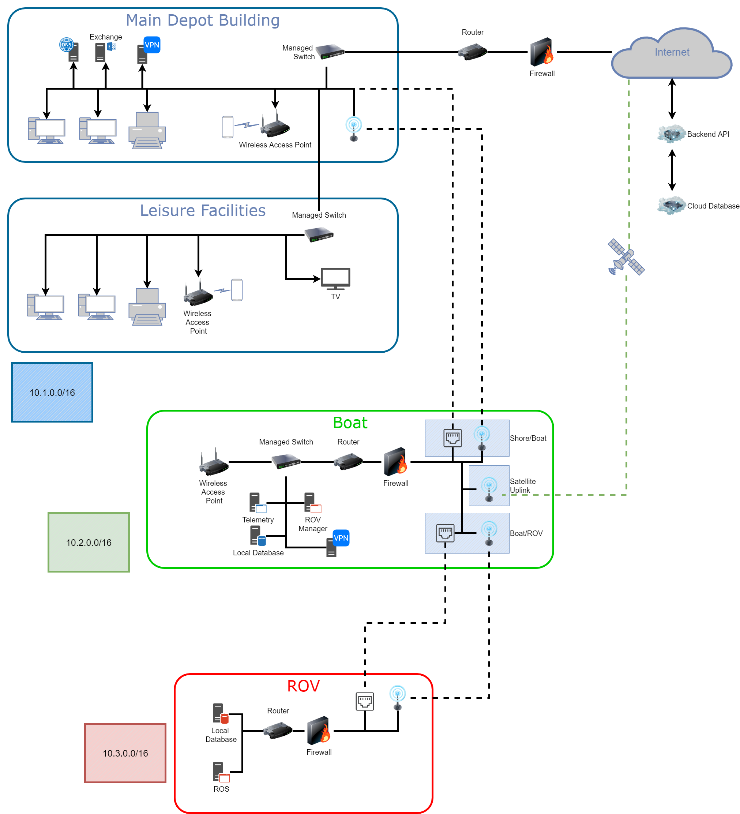

MDDP - Subsea Cable Maintenance Ship
==========================

Materials associated with post-grad MDDP (Multi-disciplinary design project). Designing a new ship capable of maintaining subsea fibre-optic cables.

